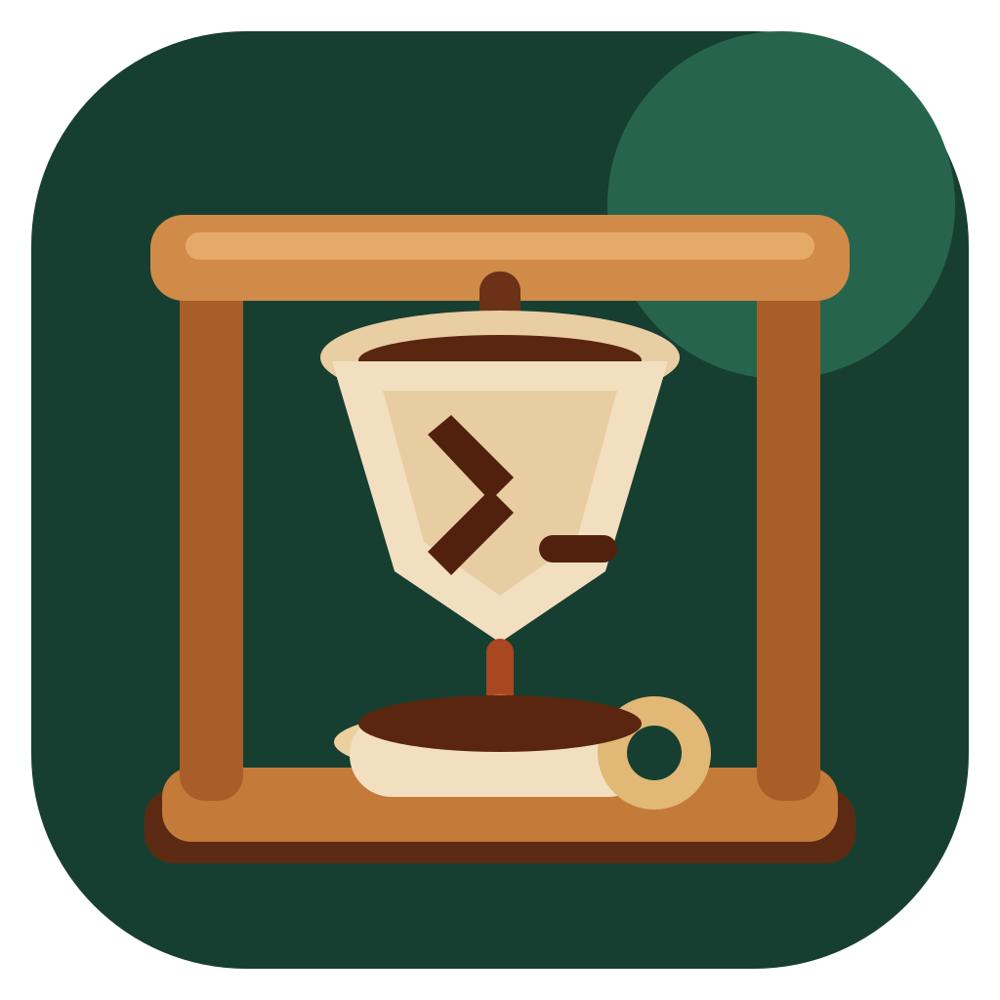

<p align="center">
  
</p>

<h1 align="center">Chorreador</h1>

<p align="center">
  <strong>Que el agente siga. Que la pantalla descanse.</strong><br>
  Keep your agents flowing while your display rests.
</p>

<p align="center">
  A tiny native macOS menu-bar app, made in Costa Rica, that keeps long-running local AI sessions awake automatically.
</p>

## Why “Chorreador”?

A **chorreador** <em>(cho-reh-ah-DOR)</em> is Costa Rica’s traditional coffee brewer: hot water flows through grounds held in a cloth filter and drips into the cup below.

This app does something similar for local coding work. It watches the flow of your agent processes, keeps the Mac awake while they run, and lets the display rest along the way.

## Supported agents

Chorreador watches locally for:

- **Claude Code**
- **Codex CLI and active Codex Desktop tasks**
- **Cursor Agent**
- **OpenCode**
- **T3 Code**

When a supported agent starts, Chorreador prevents idle system sleep. Most agents return to normal sleep behavior within the next 10-second check after they exit. Codex Desktop uses a five-minute quiet lease so long reasoning and tool calls remain protected between activity events.

Need another runtime? Add it under **Custom processes** and Chorreador will include it in the same local scan. A plain entry matches an executable name; an entry containing a space or `/` matches anywhere in the command line, which covers tools that run inside interpreters — `hermes --provider` catches a Python venv job, `scripts/clean-driver.sh` a shell wrapper, `rag/ingest-incremental.ts` a Node script. Keep fragments specific to the job so an always-on daemon can't hold the pour forever.

## Why it feels safe

- **Local-only detection.** Process names never leave your Mac.
- **Private desktop status.** Desktop detection only inspects local event type and completion metadata; nothing leaves your Mac.
- **Display-friendly.** Screen sleep remains enabled by default.
- **Battery-aware.** The pour pauses at 20% while running on battery.
- **No permanent changes.** No `pmset`, administrator access, daemon, or background service.
- **Agent-aware.** Ordinary editor helpers and crash reporters do not trigger protection.
- **Desktop-aware.** Active Codex Desktop workers count, while its idle app shell does not.

## Pour modes

| Mode | What it does |
|---|---|
| **Auto-pour for agents** | Watches all supported agents every 10 seconds |
| **Manual pour** | Keeps the Mac awake on demand |
| **Let the display rest** | Protects the session without keeping the screen lit |
| **Battery care** | Stops protection at 20% while unplugged |
| **Brew timer** | Keeps the Mac awake for 30 minutes, 1 hour, or 2 hours |

## Small comforts

- **Launch at login** so auto-pour is ready before your agents are.
- **Live activity** showing which agents are flowing and for how long.
- **Custom processes** for tools such as Aider, Goose, or your own scripts — by executable name or command-line fragment.
- **Quiet notifications** only when an agent pour starts, finishes, or pauses for battery care.
- **Persistent timers** that survive relaunch and expire automatically.

## Install

Download the latest zip from [GitHub Releases](https://github.com/greenscript/chorreador/releases), move **Chorreador.app** to your Applications folder, and open it.

The universal build supports both Apple silicon and Intel Macs running macOS 13 or newer.

Release builds are currently ad-hoc signed rather than Apple-notarized. On first launch, macOS may ask you to confirm the app in **System Settings → Privacy & Security**. The complete source and build process are available here for inspection.

## Build from source

Requires macOS 13 or newer, Xcode Command Line Tools, and ImageMagick for packaging the icon.

```sh
git clone https://github.com/greenscript/chorreador.git
cd chorreador
zsh scripts/build-app.sh
open dist/Chorreador.app
```

For development:

```sh
CLANG_MODULE_CACHE_PATH="$PWD/.build/clang-cache" \
SWIFTPM_MODULECACHE_OVERRIDE="$PWD/.build/swift-cache" \
swift test --disable-sandbox
zsh scripts/build-app.sh debug
```

## A small but important limitation

Chorreador blocks **idle** sleep. Closing a MacBook lid, choosing Sleep manually, shutting down, or macOS critical-battery protection can still suspend the Mac. Quitting Chorreador immediately releases its assertion.

## License

Chorreador is available under the [MIT License](LICENSE).

---

<p align="center">
  <em>Hecho en Costa Rica con café y código.</em>
</p>
